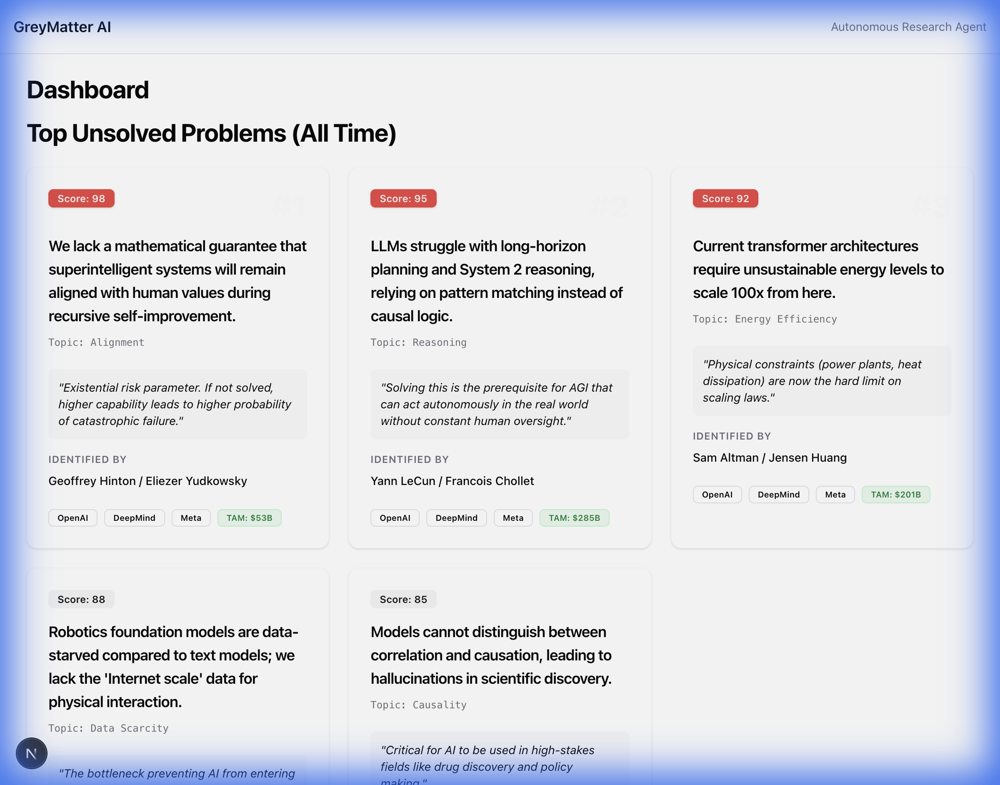

# GreyMatter Agent: Unsolved Problems

**GreyMatter** constitutes an autonomous research system designed to identify, verify, and prioritize "Big Unsolved Problems" in technology and science.



## 🚀 Overview

The system operates on a daily cycle to:
1.  **Monitor Thought Leaders**: Tracks 65+ key figures (e.g., Yann LeCun, Demis Hassabis) for signals on improved "bottlenecks" or "hard problems".
2.  **Verify & Rank**: Uses sub-agents to verify novelty, estimate Total Addressable Market (TAM), and assign an **Importance Score**.
3.  **Visualize**: Updates a cumulative "All-Time" leaderboard and a "Daily Findings" report.

## 🏗️ Architecture

*   **Agent (`/agent`)**: Python-based orchestrator.
    *   **Append Mode**: New findings are appended to the historical record, allowing for long-term trend analysis.
    *   **Ranking Engine**: Problems are constantly re-ranked based on their `importance_score` (0-100).
*   **dashboard (`/web-app`)**: Next.js + TailwindCSS.
    *   **Dual View**: Shows "Top Unsolved Problems (All Time)" and "Latest Findings".
    *   **Rich Cards**: Displays Problem Statement, Source, and Market Analysis.

## 🛠️ Usage

### 1. Run the Agent
```bash
cd agent
pip install -r requirements.txt
python main.py
```
*Runs the research loop and updates `web-app/public/report.json`.*

### 2. View the Dashboard
```bash
cd web-app
npm install
npm run dev
```

## 📊 Data Structure

The system tracks problems with the following schema:
*   **Problem Statement**: Explicit definition of the gap.
*   **Importance Justification**: Why this matters (e.g., "Prerequisite for AGI").
*   **Score**: Calculated priority (0-100).
4.  **Provenance**: Who identified it (Source).
5.  **TAM**: Market estimate.

## 🕰️ Production Schedule (Daily)

The agent is designed to run autonomously. It includes built-in retry logic for rate limits and will wait exponentially if the API quota is exceeded.

To schedule it to run daily at 4:00 AM PST:
1.  Edit `com.greymatter.agent.plist` (generated in the root).
2.  Copy to LaunchAgents: `cp com.greymatter.agent.plist ~/Library/LaunchAgents/`
3.  Load it: `launchctl load ~/Library/LaunchAgents/com.greymatter.agent.plist`
